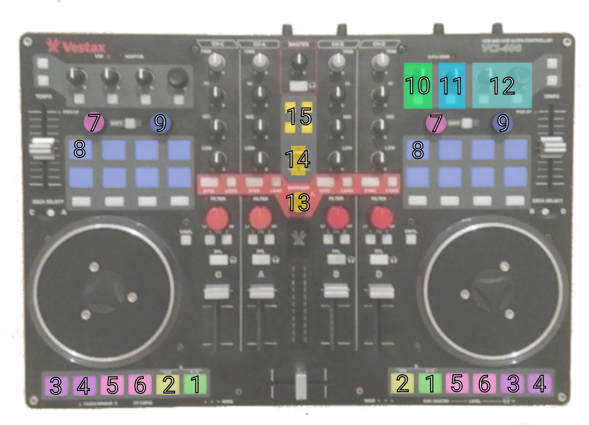

# Vestax VCI 400 Mixxx MIDI Controller Mapping

  

- 1: Play/Pause button
- 2: Cue Button

Pink/Purple: Loop Controls
- 3: loop in
- 4: loop out
- 5: activate loop
- 6: deactivate loop
- 7
  - rotate: move loop region
  - press + rotate: halve/double loop region
  - shift + rotate: ...

Blue: Transport Controls
- 8: Cue buttons 1 to 8. 
  - shift + press: delete cue point
- 9
  - rotate: move cursor through track
  - shift + rotate: change stepsize
  
Turquise & Green: Effects
- 10
  - knob: effect chain crossfade
  - button: activate/deactivate on master
- 11
  - knob: reverb strength
  - button: activate/deactivate reverb
- 12
  - knob 1: echo feedback strength
  - button 1: activate/deactivate echo
  - knob 2: echo delay time
  - button 2: ping-pong on/off
  
Gold
- 13
  - rotate: select track in library
  - shift + rotate: select playlist
- 14: select waveform zoom
- 15:
  - top buttons: set beatgrid to cursor (left/right deck)
  - bottom buttons: sync beatgrid to other deck (left/right deck)
